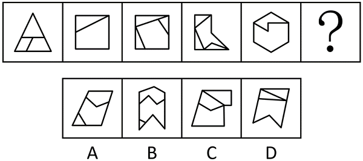
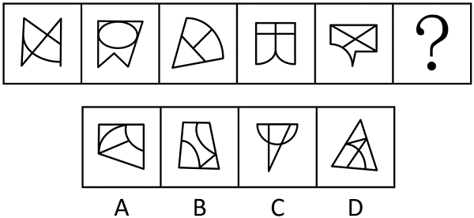
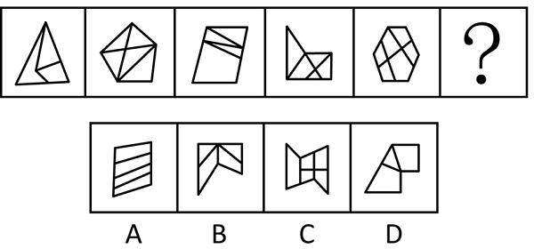
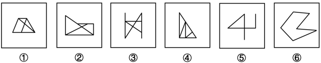
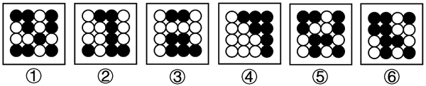

<!-- 来源版本：网友回忆版；题目保持来源页面原文，不进行改写。 -->

## 行测-2024-浙江A类-图形推理-071

**题型：** 单选

**题干：** 从所给的四个选项中，选择最合适的一个填入问号处，使之呈现一定的规律性：

**题目图片：**

**选项：**

- [ ] A. A
- [ ] B. B
- [ ] C. C
- [ ] D. D

**来源：** 公考真题库《2024年浙江省公务员录用考试《行测》题（A类）（网友回忆版）》（网友回忆版），第71题，https://gwy.gkzhenti.cn/paper/1723610466714

**题目来源类型：** 真题

**标签：** `#浙江` `#图形推理` `#真题` `#网友回忆版` `#行测`

[查看本题答案](../../../答案/行测/图形推理/2024-浙江-A类-答案.md#行测-2024-浙江A类-图形推理-071)

## 行测-2024-浙江A类-图形推理-072

**题型：** 单选

**题干：** 从所给的四个选项中，选择最合适的一个填入问号处，使之呈现一定的规律性：

**题目图片：**

**选项：**

- [ ] A. A
- [ ] B. B
- [ ] C. C
- [ ] D. D

**来源：** 公考真题库《2024年浙江省公务员录用考试《行测》题（A类）（网友回忆版）》（网友回忆版），第72题，https://gwy.gkzhenti.cn/paper/1723610466714

**题目来源类型：** 真题

**标签：** `#浙江` `#图形推理` `#真题` `#网友回忆版` `#行测`

[查看本题答案](../../../答案/行测/图形推理/2024-浙江-A类-答案.md#行测-2024-浙江A类-图形推理-072)

## 行测-2024-浙江A类-图形推理-073

**题型：** 单选

**题干：** 从所给的四个选项中，选择最合适的一个填入问号处，使之呈现一定的规律性：

**题目图片：**

**选项：**

- [ ] A. A
- [ ] B. B
- [ ] C. C
- [ ] D. D

**来源：** 公考真题库《2024年浙江省公务员录用考试《行测》题（A类）（网友回忆版）》（网友回忆版），第73题，https://gwy.gkzhenti.cn/paper/1723610466714

**题目来源类型：** 真题

**标签：** `#浙江` `#图形推理` `#真题` `#网友回忆版` `#行测`

[查看本题答案](../../../答案/行测/图形推理/2024-浙江-A类-答案.md#行测-2024-浙江A类-图形推理-073)

## 行测-2024-浙江A类-图形推理-074

**题型：** 单选

**题干：** 把下面的六个图形分为两类，使每一类图形都有各自的共同特征或规律，分类正确的一项是：

**题目图片：**

**选项：**

- [ ] A. ①④⑤，②③⑥
- [ ] B. ①②⑥，③④⑤
- [ ] C. ①⑤⑥，②③④
- [ ] D. ①③④，②⑤⑥

**来源：** 公考真题库《2024年浙江省公务员录用考试《行测》题（A类）（网友回忆版）》（网友回忆版），第74题，https://gwy.gkzhenti.cn/paper/1723610466714

**题目来源类型：** 真题

**标签：** `#浙江` `#图形推理` `#真题` `#网友回忆版` `#行测`

[查看本题答案](../../../答案/行测/图形推理/2024-浙江-A类-答案.md#行测-2024-浙江A类-图形推理-074)

## 行测-2024-浙江A类-图形推理-075

**题型：** 单选

**题干：** 把下面的六个图形分为两类，使每一类图形都有各自的共同特征或规律，分类正确的一项是：

**题目图片：**

**选项：**

- [ ] A. ①②③，④⑤⑥
- [ ] B. ①③④，②⑤⑥
- [ ] C. ①④⑥，②③⑤
- [ ] D. ①⑤⑥，②③④

**来源：** 公考真题库《2024年浙江省公务员录用考试《行测》题（A类）（网友回忆版）》（网友回忆版），第75题，https://gwy.gkzhenti.cn/paper/1723610466714

**题目来源类型：** 真题

**标签：** `#浙江` `#图形推理` `#真题` `#网友回忆版` `#行测`

[查看本题答案](../../../答案/行测/图形推理/2024-浙江-A类-答案.md#行测-2024-浙江A类-图形推理-075)
